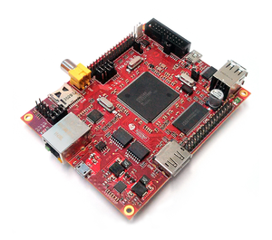

Architech's Hachiko documentation
=================================

.. only:: html

.. include:: index_custom.rst

If you are a new user of the **Yocto based SDK** we suggest you to read the :ref:`quick` chapter,
otherwise, if you want to have a better understanding of specific topics, just jump directly to
the chapter that interests you the most.

Furthermore, we encourage you to read the `official Yocto Project documentation <https://www.yoctoproject.org/documentation>`_.

Notations
---------

Throughout this guide, there are commands, file system paths, etc., that can either refer to the
machine (real or virtual) you use to run the SDK or to the board.

.. host::

 This box will be used to refer to the machine running the SDK

.. board::

 This box will be used to refer to Hachiko board

Chapters
--------

.. toctree::
  :maxdepth: 2
  :numbered:

  unboxing
  quick
  sdk-architecture
  create-sdk
  bsp
  tools
  board
  faq

