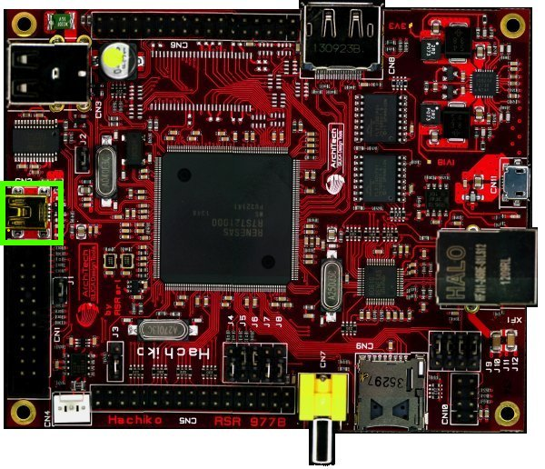

On Hachiko there is the dedicated serial console connector **CN2**

which you can connect, by means of a mini-USB cable, to your personal computer.

.. note::

 Every operating system has its own killer application to give you a serial terminal interface. In this guide, we are assuming your **host** operating system is **Ubuntu**.

On a Linux (Ubuntu) host machine, the console is seen as a ttyUSBX device and you can access to it by means
of an application like *minicom*.

*Minicom* needs to know the name of the serial device. The simplest way for you to discover
the name of the device is by looking to the kernel messages, so:

1. clean the kernel messages

.. host::

 sudo dmesg -c

2. connect the mini-USB cable to the board

3. display the kernel messages

.. host::

 dmesg

3. read the output

.. raw:: html

 

 
<b class="admonition-host">&nbsp;&nbsp;Host&nbsp;&nbsp;</b>&nbsp;&nbsp;<a style="float: right;" href="javascript:select_text( 'serial_console_rst-host-191' );">select</a>

 <pre class="line-numbers pre-replacer" data-start="1"><code id="serial_console_rst-host-191" class="language-markup">[ 2912.634893] usb 3-4: &gt;new full-speed USB device number 6 using xhci_hcd
 [ 2912.658153] usb 3-4: &gt;New USB device found, idVendor=0403, idProduct=6001
 [ 2912.658160] usb 3-4: &gt;New USB device strings: Mfr=1, Product=2, SerialNumber=3
 [ 2912.658164] usb 3-4: &gt;Product: Hachiko Rev. B
 [ 2912.658167] usb 3-4: &gt;Manufacturer: AVNET EMG ITALY
 [ 2912.658169] usb 3-4: &gt;SerialNumber: A6XGP6WP
 [ 2912.660753] ftdi_sio 3-4:1.0: &gt;FTDI USB Serial Device converter detected
 [ 2912.660801] usb 3-4: &gt;Detected FT232RL
 [ 2912.660805] usb 3-4: &gt;Number of endpoints 2
 [ 2912.660809] usb 3-4: &gt;Endpoint 1 MaxPacketSize 64
 [ 2912.660812] usb 3-4: &gt;Endpoint 2 MaxPacketSize 64
 [ 2912.660815] usb 3-4: &gt;Setting MaxPacketSize 64
 [ 2912.661102] usb 3-4: &gt;FTDI USB Serial Device converter now attached to ttyUSB0</code></pre>
 
 
 

As you can see, here the device has been recognized as **ttyUSB0**.

Now that you know the device name, run *minicom*:

.. host::

 sudo minicom -ws

If minicom is not installed, you can install it with:

.. host::

 sudo apt-get install minicom

then you can setup your port with these parameters:

::

    +-----------------------------------------------------------------------+
    | A -    Serial Device      : /dev/ttyUSB0                              |
    | B - Lockfile Location     : /var/lock                                 |
    | C -   Callin Program      :                                           |
    | D -  Callout Program      :                                           |
    | E -    Bps/Par/Bits       : 115200 8N1                                |
    | F - Hardware Flow Control : No                                        |
    | G - Software Flow Control : No                                        |
    |                                                                       |
    |    Change which setting?                                              |
    +-----------------------------------------------------------------------+
            | Screen and keyboard      |
            | Save setup as dfl        |
            | Save setup as..          |
            | Exit                     |
            | Exit from Minicom        |
            +--------------------------+

If on your system the device has not been recognized as *ttyUSB0*, just replace *ttyUSB0*
with the proper device.

Once you are done configuring the serial port, you are back to *minicom* main menu and you can select *exit*.
