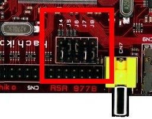

.. _unboxing_label:

********
Unboxing
********

This amazing board gets the power directly from the USB, so it comes with no external power supply.

This is what the box looks like

.. image:: _static/unboxing_close.jpg

And this is the content of box

.. image:: _static/unboxing_open.jpg

| The board itself has been programmed to boot to a Linux console of a really tiny distribution,
| custom tailored to fit the 10MB of internal ram of Renesas's SoC.
| First of all, make sure the board can boot from the pen drive by setting the jumpers J4 short pin2-3, J5 short pin1-2, J6 short pin1-2, J7 short pin 2-3 and J8 short pin2-3 with this configuration:

Shall we power on the board for the first time? Of course!

.. include:: serial_console.rst

Give *root* to the login prompt:

.. board::

 hachiko login: root

and press *Enter*.

.. note::

 Sometimes, the time you spend setting up minicom makes you miss all the output that leads to the login and you see just a black screen, press *Enter* then to get the login prompt.

Enjoy!